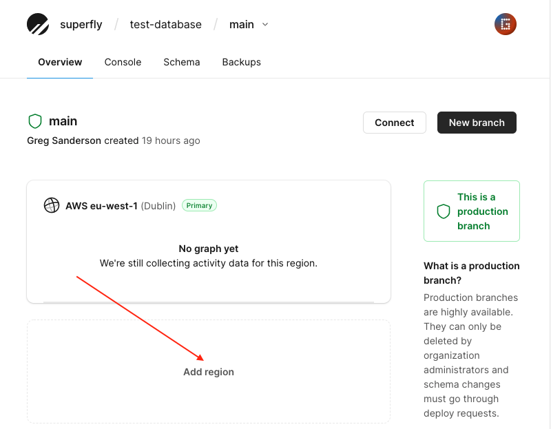

Fly runs a global application platform. In seconds it can build a Docker image and run it on a fast, secure Firecracker micro-vm in one of 21 regions. [Give it a try](https://fly.io/docs/speedrun/)!

For a long time there was a major hurdle running applications globally: the database. To do something useful, applications generally need to work with data. Store it. Process it. Return it. And do that _quickly_. If a database is in a single region, connecting to it from _that_ region is no problem. Connecting to it from the other side of _the planet_ is a problem. It's _slow_.

How we can we solve that?

## Read replicas

The simplest solution is to replicate your data. If your application is running on servers in Europe, the United States and Australia, replicate your _database_ in those regions too. Most requests only read data. If those requests can be handled by a nearby read replica, you can drastically reduce your application's response time.

Fly provides [managed Postgres](https://fly.io/docs/reference/postgres/). It supports read replicas. You can create a free Postgres cluster and connect to that from your app using their encrypted, private network.

But what if you need MySQL?

## Planetscale

Planetscale is a MySQL-compatible database designed for modern, serverless applications.

It is powered by [Vitess](https://planetscale.com/vitess). Vitess was built by Google to handle the massive scale of YouTube and is now used by the world's biggest sites, such as Airbnb and Shopify. Slack have written a [blog post](https://slack.engineering/scaling-datastores-at-slack-with-vitess/) about their experience with it.

You don't need to worry about connection pooling. Or over-provisioning resources. Database connections consume memory. As such, the number of connections a database allows is often limited by its provider. If your application uses many vms, you may be currently over-provisioning to allow for their database connections.

Planetscale has other useful features. It auto-scales. You can [deploy changes to your schema](https://planetscale.com/blog/non-blocking-schema-changes) with no downtime. And even [rewind changes](https://planetscale.com/blog/its-fine-rewind-revert-a-migration-without-losing-data) if you make a mistake.

However up until now it did not support read replicas ...

## Read-only regions

Planetscale have now enabled read-only regions for all users on their _Scaler_ and _Enterprise_ plans. In their console it is as simple as clicking on your production branch and clicking that option:



It may take a moment for the new region to become available, particularly if there is a large amount of data to replicate. Once available you can obtain a username and password to access that region from their console. Simply click on the _Connect_ button.

Each additional region adds to your storage cost, however there is no additional fee beyond that. Reads are billed as usual.

## Which database/region should the app connect to?

There are three approaches you could take:

### Use one database URL

The simplest option. This will work with _all_ applications, out of the box. Use a single connection string:

[Prisma](https://prisma.io)?

```js
datasource db {
  provider = "mysql"
  url      = env("DATABASE_URL")
}
```

[Laravel Eloquent](https://laravel.com/docs/9.x/database#configuration-using-urls)?

```php
'mysql' => [
    'driver' => 'mysql',
    'url' => env('DATABASE_URL'),
    ...
]
```

Since we are providing only one connection string, that _must_ be for the primary database. But if we are only providing the connection string for the primary database, any read replicas will _never_ be used.

We can do better.

### Use one database URL for reads and another for writes

How this is done depends on your application. PHP's Eloquent supports providing [separate read and write values](https://laravel.com/docs/9.x/database#read-and-write-connections) in the configuration. Rails lets you switch database connections. Others, like Prisma, appear to [not yet support read replicas](https://github.com/prisma/prisma/issues/172).

You _could_ open two separate connections ...

```js
const connectionRead = mysql.createConnection(...);
connectionRead.connect()
const connectionWrite = mysql.createConnection(...);
connectionWrite.connect()
```

... and then in your _code_ use the appropriate one depending on whether your query needed to read or write.

But you now have _two_ connections to your database from every server. Which isn't _great_.

It still hasn't improved the latency for writes.

What if the read replica is actually further away than your primary database? You have made reads _slower_.

And if there are multiple read replicas, how do we know which one to connect to?

### Use one database URL for reads ... and writes?

Ideally we want to connect to only one database from each vm. Since we want the lowest latency we also want that to be the _closest_ database.

If you have used Fly's Postgres, you may recall this kind of thing is handled for you automatically. Simply use `your-pg-app.internal` and their DNS magic will make sure the closest database vm handles that request.

Planetscale does not have a similar universal hostname. We have to select the one to connect to at run-time.

We _could_ use lots of environment variables. A `DATABASE_URL_LHR`, a `DATABASE_URL_IAD` ... and so on. One per region. That approach may work better for you if you only have a few regions. You would then simply look up the appropriate connection string based on the value of the `FLY_REGION` [environment variable](https://fly.io/docs/reference/runtime-environment/#environment-variables).

We've taken a different approach with our sample app. We start by asking for a single `DATABASE_URL` environment variable. Its value _can_ be a single connection string. If so, its the primary database. Or it can be a comma-separated string (using a string avoids having to parse JSON objects/arrays). For example:

```toml
DATABASE_URL='connection-string-for-primary-database,connection-string-for-a-read-only-region'
```

We can therefore easily know whether there are any read replicas by simply checking if there is more than one connecton string. We also know which is the primary (as we specify that should always be put first).

Assuming there is at least one read-only region, the question then is whether the app would get a faster response by connecting to that or by connecting to the primary. That depends on where the app is running. And Fly tells us that, at run-time. Based on that region we can choose where we would _prefer_ to connect to (these arrays would need refining based on [actual data](https://www.cloudping.co/grid)):

```js
switch (process.env.FLY_REGION) {
    case 'ewr': // Secaucus, NJ (US)
        dbRegions = ['us-east', 'us-west', 'aws-sa-east-1', ...];
        break;

    case 'lhr': // London (UK)
        dbRegions = ['eu-west', 'eu-central', 'us-east', ...];
        break;

    ...
}
```

But _our_ app doesn't know if you have a database in any of those regions. If your app is running in `lhr` it can't just _assume_ you have a database in `eu-west`. So it has a look at each connection string:

```js
for (const dbRegion of dbRegions) {
    for (const connectionString of connectionStrings) {
        if (connectionString.includes(dbRegion)) {
        // found one: this should be the closest database region that also has a database in :)
            return connectionString;
        }
    }
}
```

Inner loops aren't _ideal_ however this only needs to run _once_ when the vm is started and so adds no overhead. It picks the closest database to the vm. That may be a read replica or the primary.

So using either of these approaches (more environment variables, or more code) we've connected to the closest database. We have reduced the latency of reads as much as possible. That's great as most requests are reads. But that still leaves _writes_: if the app is connected to a read replica and tries to modify data using an `INSERT` or `UPDATE`, that will fail. How do we handle that?

## Replay requests

Our logic connects each vm to the _closest_ database. So for a write to succeed, we need that request handled by a vm in a region close to the primary database.

Fly has a neat trick: it can replay HTTP requests in another region. Since HTTP is cheap, we can ship the whole HTTP request inside Fly's network to another region. And the user is none the wiser.

We simply need to know when to do that and where to send the request to.

### When?

We _could_ just look at the HTTP method. It's likely a GET request is a read or a POST is a write. But that may be wrong. We need a better way.

Handily when the app tries to write to a read-only region, the database will generate an exception. We can simply listen out for that. For example in Express we could look out for an exception complaining about `"rdonly"`:

```js
app.use((err, req, res, next) => {
    if (typeof err.sqlMessage === "string" && err.sqlMessage.includes("current type: rdonly")) {
        ...
    }
})
```

### Where?

We know this request needs shipping off to ... somewhere. But where? Well recall above where we said there needs to be a Fly region close to the primary database? The app just needs to be told where that is. Simply put that in the `fly.toml`:

```toml
[env]
PRIMARY_REGION = "lhr"
```

Armed with that we can ship any failed writes off to `lhr`. That's all handled auto-magically within Fly's CDN, using a `fly-replay` header. Again, a sample Express error handler could work like this. If it sees a failed write, _those_ requests are replayed in the specified `PRIMARY_REGION`:

```js
app.use((err, req, res, next) => {
    if (typeof err.sqlMessage === "string" && err.sqlMessage.includes("current type: rdonly")) {
        res.header('fly-replay', 'region='  + process.env.PRIMARY_REGION)
        return res.status(409).send("Replaying request in " + process.env.PRIMARY_REGION)
    }

    // ... else something else went wrong
    console.error(err.stack)
    res.status(500).send('Something went wrong')
})
```

## This approach is not suitable for everyone

- Some applications need to keep data in a particular geographic region for compliance. It's not possible to replicate such data across continents. But you could still use read-only regions (for example using `us-west` and `us-east` would keep your data in the US).

- There is a slight delay in replicating data. If your application needs strong consistency it may not tolerate writing to one database and subsequently reading from another. Though there are techniques to mitigate this (such as sticky connections, perhaps using a cookie, to require _subsequent_ reads to use the same database).

- Finally, Planetscale's billing model may not be appropriate for some applications. They charge per row read and row written. Note that is not row _fetched_. If a row is read during a query, it is billed for. As such, to avoid an unexpected bill, make sure your queries use an index. Repeated table scans could get very expensive, very quickly.

Any questions? [Join the discussion](https://community.fly.io).